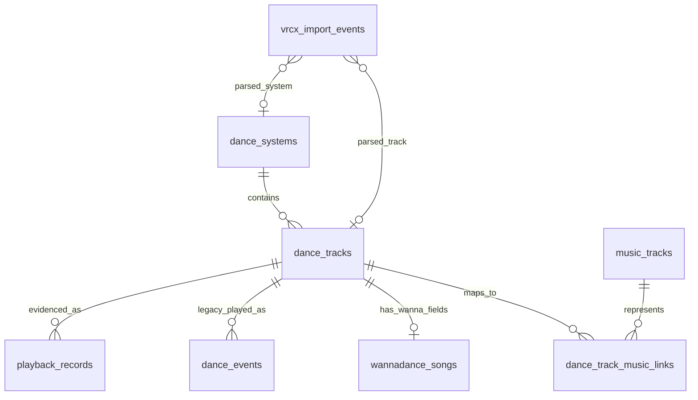

# Dance Data Model

Date: 2026-05-17
Updated: 2026-06-22

This document describes the current SQLite runtime model for `dancing-log`.
The project no longer uses the legacy `songs` table or
`dance_events.song_id` path.
After the legacy cleanup recorded in ADR 0004, `playback_records` is the
Local Playback Evidence v0 read contract for normal Timeline and Insights
queries.

## Current Scope

The first refactor implements the core model directly:

- SQLite is the runtime store.
- Generated CSV/JSON files are import/export artifacts only.
- Existing generated data is archived during rebuild, not migrated in place.
- `config/dancing-log.local.json` and `data/queued_self/` are preserved as local inputs.
- WannaDance is the first implemented dance system.
- PyPyDance URL identity is supported from observed logs; Dudu, VRDancing, and
  other systems remain unsupported until their real metadata shapes are
  inspected.
- `music_tracks` and `dance_track_music_links` are implemented with conservative
  title/artist matching.
- `playback_records` is the current Local Playback Evidence root for accepted
  history, review attention, Timeline, and Insights reads.
- `dance_events`, `vrcx_import_events`, and `live_playback_events` are retained
  as Legacy Playback Roots or runtime observation tables during the transition.
- Provider matching and popularity snapshots are deferred.

## Why The Model Changed

The original schema was convenient for a WannaDance-only workflow, but it mixed
several different concepts in one place:

- a dance-system catalog entry
- a real music track
- WannaDance-specific cache fields
- recommendation metadata
- playback history

That becomes painful once playback events can come from multiple dance systems.
Different systems can use different ids for the same song, and even one system
can have multiple choreographies, remixes, or player-count versions for the same
music track.

The current model separates "a playable dance entry in one dance system" from
"the real music track that entry uses".

## Core Concepts

### Dance System

A dance system is the source namespace for playable entries. Examples:

- `wannadance`
- `pypydance`
- `dudu`
- `vrdancing`

Only `wannadance` is implemented today.

### Dance Track

A dance track is one playable version inside one dance system.

Examples:

- WannaDance `3114`: `Boy With Luv (Extreme) / BTS & Halsey`
- WannaDance `5038`: `Good Time / Owl City`
- A future PyPyDance entry with its own id and metadata

The stable identity is `(system_id, external_id)`.

### Music Track

A music track represents the real song, independent of dance system and
choreography.

Examples:

- `Good Time / Owl City`
- `Boy With Luv / BTS & Halsey`

It intentionally does not contain dancer, player count, choreography version, or
dance-system id.

### Playback Record

A playback record is Local Playback Evidence that a dance track was observed,
imported, cleaned, or merged at a time.

It points to `playback_records.dance_track_id`, not to a WannaDance id directly.
Acceptance state such as `accepted` or `needs_attention` lives on the playback
record. Accepted rows with `counts_in_history = 1` are the normal source for
Timeline and Insights.

### Legacy Dance Event

A legacy dance event is an older normalized playback-history row in
`dance_events`. It is kept for compatibility, migration, and diagnosis, but it
is not the long-term canonical root for ordinary playback history.

## Runtime Tables

### `dance_systems`

Stores supported dance systems.

| Column | Type | Meaning |
|---|---|---|
| `id` | INTEGER PRIMARY KEY AUTOINCREMENT | Internal system id |
| `key` | TEXT UNIQUE NOT NULL | Stable machine key, for example `wannadance` |
| `name` | TEXT NOT NULL | Display name |
| `created_at` | TEXT | Creation timestamp |

### `dance_tracks`

Stores playable dance entries.

| Column | Type | Meaning |
|---|---|---|
| `id` | INTEGER PRIMARY KEY AUTOINCREMENT | Internal dance-track id |
| `system_id` | INTEGER NOT NULL | References `dance_systems.id` |
| `external_id` | TEXT NOT NULL | Id inside the dance system |
| `title` | TEXT | Dance-system title |
| `artist` | TEXT | Dance-system artist |
| `dancer` | TEXT | Dancer, choreographer, or version name |
| `player_count` | INTEGER | Number of dancers |
| `group_name` | TEXT | System-specific group/category |
| `major` | TEXT | Larger category |
| `favorite` | INTEGER NOT NULL DEFAULT 0 | Local preference flag |
| `want_to_learn` | INTEGER NOT NULL DEFAULT 0 | Local learning flag |
| `created_at` | TEXT | Creation timestamp |
| `updated_at` | TEXT | Update timestamp |

Constraint:

```sql
UNIQUE(system_id, external_id)
```

### `wannadance_songs`

Stores WannaDance-specific extension fields. These fields are intentionally not
stored in `dance_tracks` or playback history rows.

| Column | Type | Meaning |
|---|---|---|
| `dance_track_id` | INTEGER PRIMARY KEY | References `dance_tracks.id` |
| `wanna_id` | INTEGER NOT NULL UNIQUE | WannaDance song id |
| `cache_category` | INTEGER | Cache category |
| `cache_title` | TEXT | Local cache title |
| `cache_title_spell` | TEXT | Title spelling |
| `cache_player_index` | INTEGER | Player index |
| `cache_volume` | REAL | Volume |
| `cache_start_seconds` | REAL | Start offset |
| `cache_end_seconds` | REAL | End offset |
| `cache_flip` | INTEGER | Flip flag |
| `cache_skip_random` | INTEGER | Skip-random flag |
| `cache_checksum` | TEXT | Cache checksum |
| `cache_url` | TEXT | Playback URL |
| `cache_url_for_quest` | TEXT | Quest playback URL |
| `local_video_path` | TEXT | Local `video.mp4` path |
| `local_metadata_path` | TEXT | Local `metadata.json` path |
| `local_download_path` | TEXT | Local `download.txt` path |
| `cache_updated_at` | TEXT | Cache file timestamp |

### `music_tracks`

Stores canonical music-track rows created from title/artist pairs.

| Column | Type | Meaning |
|---|---|---|
| `id` | INTEGER PRIMARY KEY AUTOINCREMENT | Internal music-track id |
| `title` | TEXT NOT NULL | Song title |
| `artist` | TEXT | Artist |
| `normalized_title` | TEXT NOT NULL | Normalized title for matching |
| `normalized_artist` | TEXT NOT NULL | Normalized artist for matching |
| `created_at` | TEXT | Creation timestamp |
| `updated_at` | TEXT | Update timestamp |

Constraint:

```sql
UNIQUE(normalized_title, normalized_artist)
```

### `dance_track_music_links`

Maps dance-system entries to real music tracks.

| Column | Type | Meaning |
|---|---|---|
| `dance_track_id` | INTEGER NOT NULL | References `dance_tracks.id` |
| `music_track_id` | INTEGER NOT NULL | References `music_tracks.id` |
| `confidence` | REAL NOT NULL DEFAULT 1.0 | Match confidence |
| `match_method` | TEXT NOT NULL | Example: `title_artist_auto` |
| `created_at` | TEXT | Creation timestamp |
| `updated_at` | TEXT | Update timestamp |

Constraint:

```sql
PRIMARY KEY(dance_track_id, music_track_id)
```

### `playback_records`

Stores Local Playback Evidence for normal Timeline, review, and Insights reads.
This table is the v0 read contract after the one-time legacy cleanup.

| Column | Type | Meaning |
|---|---|---|
| `id` | INTEGER PRIMARY KEY AUTOINCREMENT | Playback record id |
| `cleanup_batch_id` | TEXT NOT NULL | Cleanup batch that created the row |
| `played_at` | TEXT NOT NULL | Normalized playback time |
| `original_played_at` | TEXT NOT NULL | Source timestamp before normalization |
| `dance_track_id` | INTEGER | References `dance_tracks.id` when resolved |
| `dance_system_key` | TEXT NOT NULL | Dance-system key, for example `wannadance` |
| `dance_external_id` | TEXT NOT NULL | System-local dance id |
| `source_kind` | TEXT NOT NULL | Broad evidence kind, such as VRCX or live watcher |
| `source_root_key` | TEXT NOT NULL | Source app root or source set key |
| `source_root_path` | TEXT NOT NULL | Source app root or database path |
| `source_table` | TEXT NOT NULL | Original source table |
| `source_row_id` | INTEGER NOT NULL | Original source row id |
| `source_event_key` | TEXT | Original source event key |
| `source_fingerprint` | TEXT NOT NULL UNIQUE | Stable source-row fingerprint for dedupe |
| `playback_status` | TEXT NOT NULL | `accepted`, `needs_attention`, or future status |
| `counts_in_history` | INTEGER NOT NULL DEFAULT 0 | Whether normal Insights/history should count this row |
| `status_reason` | TEXT NOT NULL | Reason for the current default status |
| `source_priority` | INTEGER NOT NULL DEFAULT 0 | Source priority used for overlap review |
| `confidence` | REAL | Source inference confidence |
| `event_source` | TEXT | Legacy or parser event source |
| `source_type` | TEXT | Inferred requester/source type |
| `source_display_name` | TEXT | Display name attached to source inference |
| `video_url` | TEXT | Raw playback URL |
| `video_name` | TEXT | Raw video name |
| `requester_display_name` | TEXT | Requester display name |
| `requester_user_id` | TEXT | Requester VRChat user id |
| `location` | TEXT | World or instance context |
| `completion_status` | TEXT | Live completion state when applicable |
| `completion_reason` | TEXT | Live completion reason when applicable |
| `catalog_status` | TEXT NOT NULL DEFAULT `existing` | Catalog resolution status |
| `catalog_attention` | INTEGER NOT NULL DEFAULT 0 | Whether catalog data needs attention |
| `provenance_json` | TEXT NOT NULL | Source evidence and cleanup provenance |
| `imported_at` | TEXT NOT NULL | Import timestamp |

### `dance_events`

Legacy Playback Root for older normalized playback history. It is retained for
compatibility, migration, explicit live promotion, and diagnosis. Normal
Timeline and Insights reads should use `playback_records` instead.

| Column | Type | Meaning |
|---|---|---|
| `id` | INTEGER PRIMARY KEY AUTOINCREMENT | Event id |
| `played_at` | TEXT NOT NULL | Playback time |
| `dance_track_id` | INTEGER | References `dance_tracks.id` |
| `source` | TEXT NOT NULL DEFAULT `unknown` | `queued_self`, `recommend`, `self`, `other`, `random`, or `unknown` |
| `confidence` | REAL NOT NULL DEFAULT 0.5 | Source confidence |
| `event_source` | TEXT NOT NULL | Import source, for example `manual`, `vrcx`, or `queued_self_manifest` |
| `event_key` | TEXT NOT NULL UNIQUE | Deduplication key |
| `video_url` | TEXT | Raw playback URL |
| `video_name` | TEXT | Raw video name |
| `requester_display_name` | TEXT | Requester display name |
| `requester_user_id` | TEXT | Requester VRChat user id |
| `location` | TEXT | World or instance context |
| `note` | TEXT | Manual note |
| `recording_id` | INTEGER | Future recording link |
| `recording_offset_seconds` | REAL | Future recording offset |
| `imported_at` | TEXT | Import timestamp |

### `vrcx_import_events`

Stores legacy VRCX import provenance and parse results. During the transition,
it explains old imported rows and can feed migration or cleanup. It is not the
ordinary Timeline or Insights root.

| Column | Type | Meaning |
|---|---|---|
| `id` | INTEGER PRIMARY KEY AUTOINCREMENT | Import row id |
| `vrcx_rowid` | INTEGER NOT NULL | Source VRCX rowid |
| `created_at` | TEXT NOT NULL | VRCX event time |
| `video_url` | TEXT | Raw playback URL |
| `video_name` | TEXT | Raw video name |
| `video_id` | TEXT | VRCX video id |
| `location` | TEXT | World or instance context |
| `display_name` | TEXT | Requester display name |
| `user_id` | TEXT | Requester user id |
| `parsed_system_id` | INTEGER | Parsed dance system |
| `parsed_external_id` | TEXT | Parsed system-local id |
| `parsed_dance_track_id` | INTEGER | Matched `dance_tracks.id` |
| `inferred_source` | TEXT NOT NULL DEFAULT `unknown` | Inferred event source |
| `confidence` | REAL NOT NULL DEFAULT 0.5 | Source confidence |
| `event_key` | TEXT NOT NULL UNIQUE | Deduplication key |
| `imported_at` | TEXT | Import timestamp |

### `live_playback_events`

Runtime table for `watch-vrc-log --live-db`. This table holds the latest folded
state for each live playback event and is upserted as raw log signals arrive.

Columns mirror the forensic `playback_events.jsonl` shape, including:

- `event_key` and `canonical_key`
- `first_seen_at`, `request_at`, `resolved_at`, `video_loaded_at`,
  `actual_play_at`, and `actual_play_signal_at`
- `actual_play_method`, `actual_play_offset_seconds`, `observed_mid_play`,
  `elapsed_at_first_seen_seconds`, and `synced_play_at`
- parsed dance identity fields such as `dance_system_key` and
  `dance_external_id`
- source fields such as `source_type` and `source_display_name`
- `video_url`, `resolved_url`, `video_name`, `duration_seconds`,
  `duration_source`, and raw-line provenance
- completion fields such as `completion_status`, `completion_reason`,
  `completed_at`, `interrupted_at`, `played_seconds`, and
  `required_played_seconds`
- `last_updated_at`, `promoted_dance_event_id`, and `promoted_at`

Rows from this table can currently be promoted into legacy `dance_events` only
through the explicit live promotion path. Promotion requires `completion_status =
completed`, `actual_play_at`, known `duration_seconds`,
`played_seconds >= 80% * duration_seconds`, `observed_mid_play = false`, and
parsed dance identity fields. Mid-play observations may remain `pending` so the
OBS overlay can show the current track after a mid-room join, and interrupted
rows remain useful for forensic review. Neither case should automatically
become a normal delay/statistics event.
`duration_source` records where the runtime duration came from, such as a VRCX
payload or WannaDance queue JSON; it is runtime provenance only and is not added
to normal playback history.

## Relationship Diagram



## Query Paths

From a playback record to its dance-system entry:

```text
playback_records
  -> dance_tracks
  -> dance_systems
```

From an accepted playback record to normal Insights/history:

```text
playback_records
  WHERE counts_in_history = 1
```

From a WannaDance playback record to WannaDance cache fields:

```text
playback_records
  -> dance_tracks
  -> wannadance_songs
```

From a dance entry to the real music track:

```text
dance_tracks
  -> dance_track_music_links
  -> music_tracks
```

From a music track to every dance version:

```text
music_tracks
  -> dance_track_music_links
  -> dance_tracks
  -> dance_systems
```

## Deferred Tables

Provider matching and popularity should be modeled separately from the core
timeline:

- `music_provider_matches`: future mapping from `music_tracks` to NetEase,
  Kugou, Last.fm, Spotify, or other provider ids.
- `music_popularity_snapshots`: future time-series snapshots for popularity,
  comment counts, listeners, or similar changing metrics.

These tables should not block the current runtime model. The important boundary
is that provider data belongs to `music_tracks`, not to system-specific dance
entries or playback events.

## Rebuild And Migration Policy

The current implementation does not migrate legacy generated databases in
place. If a legacy `songs` table or `dance_events.song_id` path is detected,
the app asks for a rebuild.

Use:

```bash
uv run python main.py rebuild-data --archive-existing
```

The rebuild flow archives generated files such as:

- `data/dancing_log.sqlite3`
- `data/dancing_log.sqlite3-wal`
- `data/dancing_log.sqlite3-shm`
- `data/songs.csv`
- `data/wanna_songs.csv`
- `data/wanna_songs.json`

It preserves:

- `config/dancing-log.local.json`
- `data/queued_self/`
