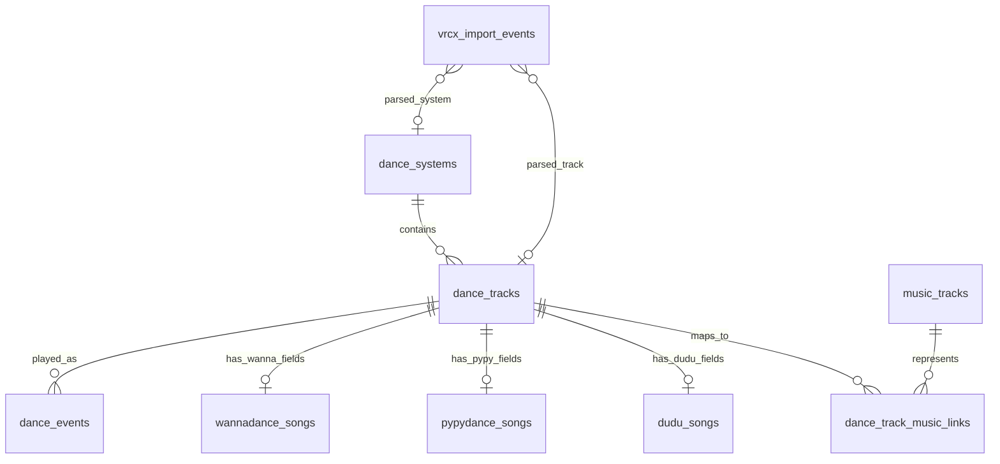

# Dance Data Model Direction

Date: 2026-05-17

## 背景

当前 SQLite schema 主要围绕 WannaDance 工作：

- `songs` 同时表示 WannaDance 歌曲条目、推荐用歌曲元数据、网易云热度信息。
- `dance_events.song_id` 直接指向 `songs.id`，等价于把一次跳舞事件绑定到 WannaDance song id。
- `songs` 中包含一些 WannaDance 特有缓存字段，例如 `cache_url`、`cache_url_for_quest`、`cache_player_index`、`cache_flip` 等。

这个结构对最初只处理 WannaDance 很方便，但未来会遇到明显边界问题：

- VRCX 的视频播放事件并不只来自 WannaDance，也可能来自 PyPyDance、Dudu、VRDancing 等舞蹈系统。
- 不同舞蹈系统对同一首歌会有不同 id、不同舞者、不同舞蹈版本。
- 同一舞蹈系统内部也可能存在重复或近似重复条目，例如同一首歌的不同编舞、不同人数版本、remix、镜像版本。
- 网易云、酷狗等音乐平台的热度信息对应的是“真实歌曲”，通常只需要歌名和歌手，不应该绑定到某个舞蹈系统的某个版本。

因此，长期方向应当把“舞蹈系统中的舞蹈条目”和“现实音乐歌曲”分开建模。

## 设计原则

1. `dance_events` 只记录跳舞事实，不存放某个舞蹈系统的专有字段。
2. 舞蹈系统条目和真实音乐歌曲不是同一个概念，不应共用一张表表达所有含义。
3. 系统内唯一 id 是事实来源，应优先保存；歌名、歌手、舞者适合做匹配线索，但不适合作为强唯一约束。
4. 重复和归并应通过映射表表达，而不是过早删除或强行合并原始条目。
5. 短期可以只实现 WannaDance，但核心表命名和关系应避免未来痛苦重构。

## 核心概念

### 舞蹈系统

舞蹈系统是歌曲/舞蹈条目的来源，例如：

- WannaDance
- PyPyDance
- Dudu
- VRDancing

同一个系统内通常有自己的 song id、播放 URL 格式、缓存字段和元数据结构。

### 舞蹈条目

舞蹈条目表示“某个舞蹈系统里的一个可播放、可跳的版本”。

例如：

- WannaDance id 3114: `Good Time / Owl City / JAMAA`
- WannaDance id 9988: `Good Time / Owl City / Another Dancer`
- PyPyDance id abc123: `Good Time / Owl City / Some Choreo`

这些条目可能都对应同一首真实歌曲，但它们在舞蹈系统里是不同版本，应该作为不同舞蹈条目保留。

### 真实歌曲

真实歌曲表示音乐平台意义上的歌曲，通常由歌名和歌手定位。

例如：

- `Good Time / Owl City`

它不包含舞者、人数、编舞版本、WannaDance id、PyPyDance id 等信息。

### 跳舞事件

跳舞事件表示“某个时间点播放/跳了某个舞蹈条目”。

一次事件应该指向统一的舞蹈条目，而不是直接指向 WannaDance、PyPyDance 或 Dudu 的专有歌曲表。

## 推荐表结构

### `dance_systems`

记录支持的舞蹈系统。

| 字段 | 类型 | 说明 |
|---|---|---|
| `id` | INTEGER PRIMARY KEY | 内部系统 id |
| `key` | TEXT UNIQUE NOT NULL | 稳定机器名，例如 `wannadance`、`pypydance`、`dudu` |
| `name` | TEXT NOT NULL | 展示名 |
| `created_at` | TEXT | 创建时间 |

作用：

- 避免在各处硬编码系统字符串。
- 允许后续逐步新增舞蹈系统。
- 和 `dance_tracks` 一起确定外部 id 的命名空间。

### `dance_tracks`

统一的舞蹈条目主表。

| 字段 | 类型 | 说明 |
|---|---|---|
| `id` | INTEGER PRIMARY KEY AUTOINCREMENT | 内部舞蹈条目 id |
| `system_id` | INTEGER NOT NULL | 对应 `dance_systems.id` |
| `external_id` | TEXT NOT NULL | 外部舞蹈系统自己的 id |
| `title` | TEXT | 舞蹈系统中的歌名 |
| `artist` | TEXT | 舞蹈系统中的歌手 |
| `dancer` | TEXT | 舞者、编舞者、版本名或系列名 |
| `player_count` | INTEGER | 舞蹈人数 |
| `group_name` | TEXT | 子分类 |
| `major` | TEXT | 大分类 |
| `favorite` | INTEGER NOT NULL DEFAULT 0 | 本地偏好标记 |
| `want_to_learn` | INTEGER NOT NULL DEFAULT 0 | 本地待练标记 |
| `created_at` | TEXT | 创建时间 |
| `updated_at` | TEXT | 更新时间 |

建议约束：

```sql
UNIQUE(system_id, external_id)
```

作用：

- 统一承接 WannaDance、PyPyDance、Dudu 等系统里的舞蹈条目。
- `dance_events` 只需要指向 `dance_tracks.id`。
- 通用推荐逻辑可以基于这张表运行。
- 外部系统的专有字段不放在这里，避免主表膨胀成大杂烩。

### `wannadance_songs`

WannaDance 专有扩展表。

| 字段 | 类型 | 说明 |
|---|---|---|
| `dance_track_id` | INTEGER PRIMARY KEY | 对应 `dance_tracks.id` |
| `wanna_id` | INTEGER NOT NULL UNIQUE | WannaDance song id |
| `cache_category` | INTEGER | WannaDance 缓存分类 |
| `cache_title` | TEXT | 缓存标题 |
| `cache_title_spell` | TEXT | 标题拼写 |
| `cache_player_index` | INTEGER | 播放器索引 |
| `cache_volume` | REAL | 音量 |
| `cache_start_seconds` | REAL | 开始时间 |
| `cache_end_seconds` | REAL | 结束时间 |
| `cache_flip` | INTEGER | 是否翻转 |
| `cache_skip_random` | INTEGER | 是否跳过随机 |
| `cache_checksum` | TEXT | 缓存校验 |
| `cache_url` | TEXT | 播放 URL |
| `cache_url_for_quest` | TEXT | Quest 播放 URL |
| `local_video_path` | TEXT | 本地视频路径 |
| `local_metadata_path` | TEXT | 本地元数据路径 |
| `local_download_path` | TEXT | 本地下载路径 |
| `cache_updated_at` | TEXT | 缓存更新时间 |

作用：

- 保存只有 WannaDance 才有意义的字段。
- 让 `dance_tracks` 和 `dance_events` 保持系统无关。
- 当前 `songs` 表中的 WannaDance 专有字段未来可迁移到这里。

### `pypydance_songs`

PyPyDance 专有扩展表。具体字段应等确认 PyPyDance 数据结构后再定。

建议基础字段：

| 字段 | 类型 | 说明 |
|---|---|---|
| `dance_track_id` | INTEGER PRIMARY KEY | 对应 `dance_tracks.id` |
| `pypy_id` | TEXT NOT NULL UNIQUE | PyPyDance 自己的歌曲/舞蹈 id |
| `raw_url` | TEXT | VRCX 或原始事件中的播放 URL |
| `raw_payload` | TEXT | 必要时保存原始解析数据 JSON |
| `updated_at` | TEXT | 更新时间 |

作用：

- 让 PyPyDance 的特殊字段有自己的归宿。
- 避免为了兼容 PyPyDance 而污染 WannaDance 表或通用表。

### `dudu_songs`

Dudu 专有扩展表。具体字段同样应等数据结构明确后再定。

建议基础字段：

| 字段 | 类型 | 说明 |
|---|---|---|
| `dance_track_id` | INTEGER PRIMARY KEY | 对应 `dance_tracks.id` |
| `dudu_id` | TEXT NOT NULL UNIQUE | Dudu 自己的歌曲/舞蹈 id |
| `raw_url` | TEXT | 原始播放 URL |
| `raw_payload` | TEXT | 必要时保存原始解析数据 JSON |
| `updated_at` | TEXT | 更新时间 |

### `dance_events`

统一跳舞事件表。

| 字段 | 类型 | 说明 |
|---|---|---|
| `id` | INTEGER PRIMARY KEY AUTOINCREMENT | 事件 id |
| `played_at` | TEXT NOT NULL | 播放/跳舞时间 |
| `dance_track_id` | INTEGER | 对应 `dance_tracks.id` |
| `source` | TEXT NOT NULL DEFAULT 'unknown' | 点歌来源：`queued_self`、`recommend`、`self`、`other`、`random`、`unknown` |
| `confidence` | REAL NOT NULL DEFAULT 0.5 | 来源推断可信度 |
| `event_source` | TEXT NOT NULL | 事件来源，例如 `manual`、`vrcx`、`vrchat_log` |
| `event_key` | TEXT NOT NULL UNIQUE | 去重键 |
| `video_url` | TEXT | 原始视频 URL |
| `video_name` | TEXT | 原始视频名 |
| `requester_display_name` | TEXT | 点歌者展示名 |
| `requester_user_id` | TEXT | 点歌者 VRChat user id |
| `location` | TEXT | 世界或实例信息 |
| `note` | TEXT | 手动备注 |
| `recording_id` | INTEGER | 未来可关联录屏表 |
| `recording_offset_seconds` | REAL | 在录屏中的偏移秒数 |
| `imported_at` | TEXT NOT NULL DEFAULT (datetime('now')) | 导入时间 |

关系：

```sql
FOREIGN KEY(dance_track_id) REFERENCES dance_tracks(id)
```

作用：

- 只记录事件事实。
- 不包含 `wanna_id`、`pypy_id`、WannaDance cache 字段等系统专有信息。
- 从事件查详情时，通过 `dance_track_id` 进入 `dance_tracks`，再按系统进入对应扩展表。

### `vrcx_import_events`

VRCX 导入暂存和溯源表仍然有价值，但建议逐步从 WannaDance 专用解析转向多系统解析。

建议方向：

| 字段 | 类型 | 说明 |
|---|---|---|
| `id` | INTEGER PRIMARY KEY AUTOINCREMENT | 导入记录 id |
| `vrcx_rowid` | INTEGER NOT NULL | VRCX 原始行 id |
| `created_at` | TEXT NOT NULL | VRCX 记录时间 |
| `video_url` | TEXT | 原始视频 URL |
| `video_name` | TEXT | 原始视频名 |
| `video_id` | TEXT | VRCX 原始 video id |
| `location` | TEXT | 世界或实例 |
| `display_name` | TEXT | 点歌者展示名 |
| `user_id` | TEXT | 点歌者 user id |
| `parsed_system_id` | INTEGER | 解析出的舞蹈系统 |
| `parsed_external_id` | TEXT | 解析出的系统内 id |
| `parsed_dance_track_id` | INTEGER | 匹配到的 `dance_tracks.id` |
| `inferred_source` | TEXT NOT NULL DEFAULT 'unknown' | 推断来源 |
| `confidence` | REAL NOT NULL DEFAULT 0.5 | 推断可信度 |
| `event_key` | TEXT NOT NULL UNIQUE | 去重键 |
| `imported_at` | TEXT NOT NULL DEFAULT (datetime('now')) | 导入时间 |

作用：

- 保留 VRCX 原始事件和解析结果，方便追溯、回填和修正规则。
- 允许同一套 importer 处理 WannaDance、PyPyDance、Dudu 等不同 URL 形态。
- 不直接承担业务查询主表职责；业务时间线仍以 `dance_events` 为准。

## 真实歌曲归并

### `music_tracks`

真实歌曲表。

| 字段 | 类型 | 说明 |
|---|---|---|
| `id` | INTEGER PRIMARY KEY AUTOINCREMENT | 内部歌曲 id |
| `title` | TEXT NOT NULL | 歌名 |
| `artist` | TEXT | 歌手 |
| `normalized_title` | TEXT | 归一化歌名，用于匹配 |
| `normalized_artist` | TEXT | 归一化歌手，用于匹配 |
| `created_at` | TEXT | 创建时间 |
| `updated_at` | TEXT | 更新时间 |

作用：

- 表示音乐平台意义上的真实歌曲。
- 不包含舞者、人数、编舞版本、舞蹈系统 id。
- 为未来网易云、酷狗等平台匹配提供统一入口。

注意：

- `title + artist` 可以作为强匹配线索，但不建议一开始做数据库级强唯一约束。
- 同名歌、翻唱、remix、翻译名和标点差异都可能导致误合并。

### `dance_track_music_links`

舞蹈条目到真实歌曲的映射表。

| 字段 | 类型 | 说明 |
|---|---|---|
| `dance_track_id` | INTEGER NOT NULL | 对应 `dance_tracks.id` |
| `music_track_id` | INTEGER NOT NULL | 对应 `music_tracks.id` |
| `confidence` | REAL NOT NULL DEFAULT 1.0 | 匹配可信度 |
| `match_method` | TEXT NOT NULL | 匹配方式，例如 `manual`、`title_artist_auto`、`provider_id` |
| `created_at` | TEXT | 创建时间 |
| `updated_at` | TEXT | 更新时间 |

建议约束：

```sql
PRIMARY KEY(dance_track_id, music_track_id)
```

作用：

- 保留多个舞蹈版本，不强行合并 `dance_tracks`。
- 允许多个舞蹈条目指向同一个真实歌曲。
- 自动匹配不准时，可以人工修正或降低可信度。
- 解决“舞蹈系统内几乎由歌名 + 歌手 + 舞者定位，音乐平台内几乎由歌名 + 歌手定位”的粒度差异。

## 关系图



## 查询示例

### 从跳舞事件查舞蹈条目

```text
dance_events
  -> dance_tracks
  -> dance_systems
```

如果系统是 WannaDance，再查：

```text
dance_tracks
  -> wannadance_songs
```

如果要查它对应的真实歌曲：

```text
dance_tracks
  -> dance_track_music_links
  -> music_tracks
```

### 从真实歌曲查所有舞蹈版本

```text
music_tracks
  -> dance_track_music_links
  -> dance_tracks
  -> dance_systems
```

这可以回答：

- 这首歌在 WannaDance 里有哪些版本？
- 这首歌在 PyPyDance 里有没有版本？
- 哪些版本我跳过？
- 哪些版本我还想学？

## 暂缓讨论的部分

音乐平台匹配和热度快照可以晚些再设计实现。

暂时只保留方向：

- `music_provider_matches`：未来用于记录 `music_tracks` 在网易云、酷狗等平台上的匹配结果。
- `music_popularity_snapshots`：未来用于记录热度、评论数等会随时间变化的数据。

这两张表不应阻塞当前数据库重构。当前更重要的是先把：

1. `dance_events`
2. `dance_tracks`
3. 各舞蹈系统专有表
4. `music_tracks`
5. `dance_track_music_links`

这些核心边界定清楚。

## 迁移方向

当前实现可以逐步迁移，不需要一次性完成。

建议顺序：

1. 新增 `dance_systems` 和 `dance_tracks`。
2. 写入一条 WannaDance 系统记录。
3. 将当前 `songs` 中的通用字段迁移到 `dance_tracks`。
4. 将当前 `songs` 中的 WannaDance 专有缓存字段迁移到 `wannadance_songs`。
5. 为 `dance_events` 新增 `dance_track_id`，先与旧 `song_id` 并存。
6. 回填 `dance_events.dance_track_id`。
7. 代码查询逐步改为使用 `dance_track_id`。
8. 确认稳定后，再考虑移除旧 `song_id` / `songs` 兼容路径。

短期只做 WannaDance 也可以按这个结构推进。重点不是一次性支持所有系统，而是先避免继续把 WannaDance 特有假设写进核心事件表。
