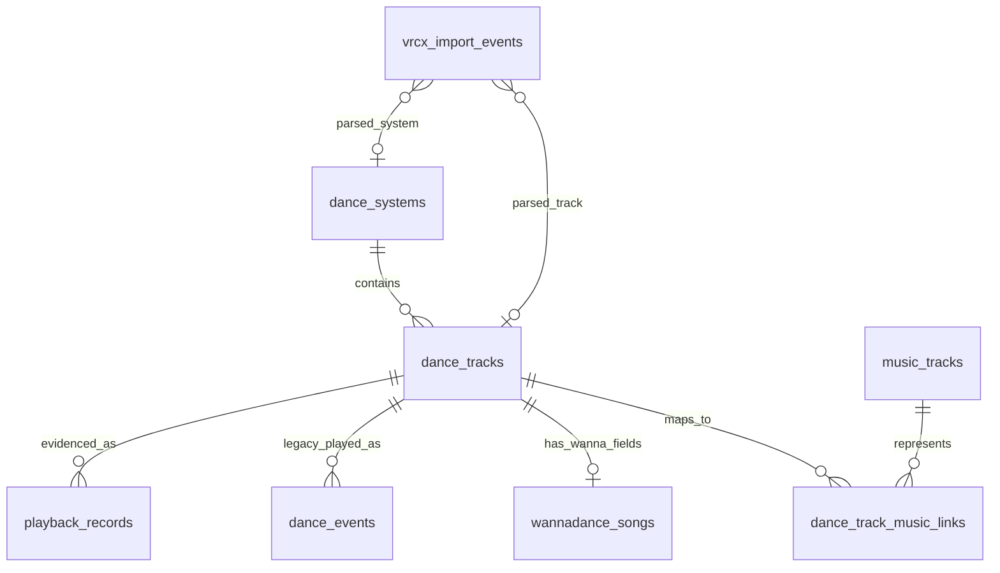

# 跳舞数据模型

日期：2026-05-17
更新：2026-07-19

本文描述 `dancing-log` 当前的 SQLite 运行时模型。项目已经不再使用旧的
`songs` 表，也不再使用 `dance_events.song_id`。
ADR 0004 记录的一次性 legacy cleanup 之后，`playback_records` 是普通
Timeline 和 Insights 查询使用的 Local Playback Evidence v0 读模型 contract。

下一版 `playback_records` schema 的目标设计以
`docs/playback_records_schema_redesign.zh-CN.md` 为准。本文保留当前/v0
运行时模型说明，不能作为新 schema 迁移目标的字段 contract。

ADR 0013 定义下一版职责边界：watcher 只采集、确定性整理并保存来源证据，不负责
durable event/occurrence 汇总、Request Source Type Inference、接受状态或历史修复。
下文出现的 watcher folding、settlement 或直接写 `playback_records` 是当前/v0 运行时
事实，不表示这些产品投影长期归 watcher 所有。

英文对应文档：`docs/dance_data_model.md`

## 当前范围

第一轮重构已经直接实现核心模型：

- SQLite 是运行时存储。
- CSV/JSON 只是导入、导出或检查产物。
- 重建时归档旧生成数据，不做原地迁移。
- `config/dancing-log.local.json` 和 `data/queued_self/` 会作为本地输入保留。
- WannaDance 是第一个有目录同步实现的舞蹈系统。
- PyPyDance URL 身份已能从实测日志中识别；DuDu FitDance 基于少量样本有
  实验性支持，能从官网/API URL、VRChat 日志元数据和 VRCX URL 中识别为
  `dudu`。Dudu 目录同步仍待实现，VRDancing 和其他系统暂不支持。
- `music_tracks` 和 `dance_track_music_links` 已实现，当前用保守的标题/歌手匹配。
- `playback_records` 是当前 accepted 历史、Review Attention、Timeline 和 Insights
  读取使用的 Local Playback Evidence 根。
- `dance_events`、`vrcx_import_events` 和 `live_playback_events` 在过渡期保留为
  Legacy Playback Root、staging 溯源或运行时观察表。
- 手动 log、VRCX import、queued-self sync 和 watcher-derived live evidence 会写入当前
  app root 拥有的 Local Playback Evidence，也就是 `playback_records`。
- 音乐平台匹配和热度快照暂缓。

## 为什么改模型

旧模型对 WannaDance 单系统很方便，但把几类不同概念混在一起：

- 舞蹈系统目录条目
- 真实音乐曲目
- WannaDance 专有缓存字段
- 推荐用的本地偏好元数据
- 播放历史事件

一旦播放事件来自多个舞蹈系统，这种结构就会很别扭。不同系统可能用不同 id
表示同一首歌，同一系统里也可能有同一首歌的不同编舞、remix、镜像版本或人数版本。

当前模型把“某个舞蹈系统里的可播放舞蹈条目”和“真实音乐曲目”拆开。

## 核心概念

### 舞蹈系统

舞蹈系统是可播放条目的命名空间。例子：

- `wannadance`
- `pypydance`
- `dudu`
- `vrdancing`

目前 `wannadance` 有目录同步实现。`pypydance` 支持 URL/playback identity；
`dudu` 是实验性 playback identity 支持，能从 watcher/VRCX 生成播放证据，
但暂未实现目录同步，不能宣称全量支持 DuDu FitDance。

### 舞蹈条目

舞蹈条目表示某个舞蹈系统里的一个可播放版本。

例子：

- WannaDance `3114`: `Boy With Luv (Extreme) / BTS & Halsey`
- WannaDance `5038`: `Good Time / Owl City`
- 未来某个 PyPyDance 条目，有自己的 id 和元数据

稳定身份是 `(system_id, external_id)`。

### 真实音乐曲目

真实音乐曲目表示音乐意义上的歌曲，和舞蹈系统、编舞版本无关。

例子：

- `Good Time / Owl City`
- `Boy With Luv / BTS & Halsey`

它不包含舞者、人数、编舞版本或舞蹈系统 id。

### 播放记录

播放记录是 Local Playback Evidence，表示某个时间点观察、导入、清洗或合并到的
舞蹈播放证据。

它指向 `playback_records.dance_track_id`，不直接指向 WannaDance id。`playback_status`
和 `counts_in_history` 等默认接受字段存在播放记录上。普通 Timeline、Insights、
daily report 和 recommendation 读取 effective playback projection：播放记录默认状态
加上当前有效的 Manual Playback Decision overlay。

### Legacy 跳舞事件

Legacy 跳舞事件是 `dance_events` 里的旧标准化播放历史 row。它保留用于兼容、迁移和
排查，但不是长期的普通播放历史 canonical root。

## 运行时表

### `dance_systems`

记录支持的舞蹈系统。

| 字段 | 类型 | 含义 |
|---|---|---|
| `id` | INTEGER PRIMARY KEY AUTOINCREMENT | 内部系统 id |
| `key` | TEXT UNIQUE NOT NULL | 稳定机器名，比如 `wannadance` |
| `name` | TEXT NOT NULL | 展示名 |
| `created_at` | TEXT | 创建时间 |

### `dance_tracks`

记录可播放舞蹈条目。

| 字段 | 类型 | 含义 |
|---|---|---|
| `id` | INTEGER PRIMARY KEY AUTOINCREMENT | 内部舞蹈条目 id |
| `system_id` | INTEGER NOT NULL | 指向 `dance_systems.id` |
| `external_id` | TEXT NOT NULL | 舞蹈系统内部 id |
| `title` | TEXT | 系统内标题 |
| `artist` | TEXT | 系统内歌手 |
| `dancer` | TEXT | 舞者、编舞者或版本名 |
| `player_count` | INTEGER | 跳舞人数 |
| `group_name` | TEXT | 系统内分组 |
| `major` | TEXT | 大分类 |
| `favorite` | INTEGER NOT NULL DEFAULT 0 | 本地收藏标记 |
| `want_to_learn` | INTEGER NOT NULL DEFAULT 0 | 本地想学标记 |
| `created_at` | TEXT | 创建时间 |
| `updated_at` | TEXT | 更新时间 |

约束：

```sql
UNIQUE(system_id, external_id)
```

### `wannadance_songs`

记录 WannaDance 专有扩展字段。这些字段不放在 `dance_tracks` 或播放历史 row 里。

| 字段 | 类型 | 含义 |
|---|---|---|
| `dance_track_id` | INTEGER PRIMARY KEY | 指向 `dance_tracks.id` |
| `wanna_id` | INTEGER NOT NULL UNIQUE | WannaDance song id |
| `cache_category` | INTEGER | 缓存分类 |
| `cache_title` | TEXT | 本地缓存标题 |
| `cache_title_spell` | TEXT | 标题拼写 |
| `cache_player_index` | INTEGER | 播放器索引 |
| `cache_volume` | REAL | 音量 |
| `cache_start_seconds` | REAL | 开始偏移 |
| `cache_end_seconds` | REAL | 结束偏移 |
| `cache_flip` | INTEGER | 翻转标记 |
| `cache_skip_random` | INTEGER | 跳过随机标记 |
| `cache_checksum` | TEXT | 缓存校验 |
| `cache_url` | TEXT | 播放 URL |
| `cache_url_for_quest` | TEXT | Quest 播放 URL |
| `local_video_path` | TEXT | 本地 `video.mp4` 路径 |
| `local_metadata_path` | TEXT | 本地 `metadata.json` 路径 |
| `local_download_path` | TEXT | 本地 `download.txt` 路径 |
| `cache_updated_at` | TEXT | 缓存文件时间 |

### `music_tracks`

记录根据标题/歌手归并出来的真实音乐曲目。

| 字段 | 类型 | 含义 |
|---|---|---|
| `id` | INTEGER PRIMARY KEY AUTOINCREMENT | 内部音乐曲目 id |
| `title` | TEXT NOT NULL | 歌名 |
| `artist` | TEXT | 歌手 |
| `normalized_title` | TEXT NOT NULL | 归一化歌名，用于匹配 |
| `normalized_artist` | TEXT NOT NULL | 归一化歌手，用于匹配 |
| `created_at` | TEXT | 创建时间 |
| `updated_at` | TEXT | 更新时间 |

约束：

```sql
UNIQUE(normalized_title, normalized_artist)
```

### `dance_track_music_links`

记录舞蹈条目到真实音乐曲目的映射。

| 字段 | 类型 | 含义 |
|---|---|---|
| `dance_track_id` | INTEGER NOT NULL | 指向 `dance_tracks.id` |
| `music_track_id` | INTEGER NOT NULL | 指向 `music_tracks.id` |
| `confidence` | REAL NOT NULL DEFAULT 1.0 | 匹配置信度 |
| `match_method` | TEXT NOT NULL | 例如 `title_artist_auto` |
| `created_at` | TEXT | 创建时间 |
| `updated_at` | TEXT | 更新时间 |

约束：

```sql
PRIMARY KEY(dance_track_id, music_track_id)
```

### `playback_records`

记录普通 Timeline、复查和 Insights 使用的 Local Playback Evidence。这张表是一次性
legacy cleanup 之后的 v0 读模型 contract。
canonical 时间字段使用带 `Z` 后缀的 ISO 8601 UTC 值。
`original_played_at` 这类 raw provenance 字段保留标准化前的来源文本。

| 字段 | 类型 | 含义 |
|---|---|---|
| `id` | INTEGER PRIMARY KEY AUTOINCREMENT | 播放记录 id |
| `cleanup_batch_id` | TEXT NOT NULL | 创建该 row 的 cleanup batch |
| `played_at` | TEXT NOT NULL | 标准化后的播放时间 |
| `original_played_at` | TEXT NOT NULL | 标准化前的来源时间 |
| `dance_track_id` | INTEGER | 解析成功时指向 `dance_tracks.id` |
| `dance_system_key` | TEXT NOT NULL | 舞蹈系统 key，比如 `wannadance` |
| `dance_external_id` | TEXT NOT NULL | 系统内舞蹈 id |
| `source_kind` | TEXT NOT NULL | 证据大类，比如 VRCX 或 live watcher |
| `source_root_key` | TEXT NOT NULL | 来源 app root 或来源集合 key |
| `source_root_path` | TEXT NOT NULL | 来源 app root 或数据库路径 |
| `source_table` | TEXT NOT NULL | 原始来源表 |
| `source_row_id` | INTEGER NOT NULL | 原始来源 row id |
| `source_event_key` | TEXT | 原始来源 event key |
| `source_fingerprint` | TEXT NOT NULL UNIQUE | 用于去重的稳定来源 row 指纹 |
| `playback_status` | TEXT NOT NULL | `pending`、`accepted`、`needs_attention` 或未来状态 |
| `counts_in_history` | INTEGER NOT NULL DEFAULT 0 | manual overlay 前，基于 evidence 推导出的默认历史统计状态 |
| `status_reason` | TEXT NOT NULL | 当前默认状态的原因 |
| `source_priority` | INTEGER NOT NULL DEFAULT 0 | overlap 复查时使用的 Evidence Source Priority |
| `confidence` | REAL | 来源推断置信度 |
| `event_source` | TEXT | legacy 或 parser event source |
| `source_type` | TEXT | Request Source Type |
| `source_display_name` | TEXT | 来源推断关联的展示名 |
| `video_url` | TEXT | 原始播放 URL |
| `video_name` | TEXT | 原始视频名 |
| `requester_display_name` | TEXT | 点歌者展示名 |
| `requester_user_id` | TEXT | 点歌者 VRChat user id |
| `location` | TEXT | 世界或实例上下文 |
| `completion_status` | TEXT | 适用时的 live 完成状态 |
| `completion_reason` | TEXT | 适用时的 live 完成原因 |
| `catalog_status` | TEXT NOT NULL DEFAULT `existing` | 目录解析状态 |
| `catalog_attention` | INTEGER NOT NULL DEFAULT 0 | 目录数据是否需要注意 |
| `provenance_json` | TEXT NOT NULL | 来源证据和 cleanup 溯源 |
| `imported_at` | TEXT NOT NULL | 导入时间 |

Request Source Type 和 Evidence Source Priority 是两个独立概念。当前 schema
用 `source_type` 存 Request Source Type，也就是 request/playback-source 分类，
比如 `queued_self`、`recommend`、`self`、`other`、`random` 或 `unknown`。
它的优先级只用于同一条 playback record 被重放或重导入时保留更强分类；例如
queued-self overlay 不应该被后续 VRCX 推断出的 `random` 降级。当前 schema
用 `source_priority` 存 Evidence Source Priority，也就是 overlap 或冲突复查时使用的
证据强度，比如 live watcher evidence、VRCX history、manual decision 或 automatic
acceptance 谁更可信。它不是 request/source 分类顺序。Request Source Type 及其分类优先级
都不决定一行最终是 accepted、excluded 还是 needs attention；这个接受投影由 playback
evidence、Evidence Source Priority 冲突规则和当前有效的 manual playback decision 负责。

`source_root_path` 在 row 绑定外部来源时应该标识 source app root 或数据库路径。
项目自身写入的 row、或为兼容 ADR 0004 cleanup 身份而保留的 row，可能保存稳定身份使用的
project/app root；如果 source table 是本地 staging，原始外部数据库路径也应该写进
`provenance_json`。

### `manual_playback_decisions`

保存 playback record 上可撤销的 Manual Playback Decision overlay。这张表不改写
Local Playback Evidence。如果某条 playback record 有一个 active decision，它会覆盖
从 `playback_records` 推导出的默认接受结果。

| 字段 | 类型 | 含义 |
|---|---|---|
| `id` | INTEGER PRIMARY KEY AUTOINCREMENT | 人工决定 id |
| `playback_record_id` | INTEGER NOT NULL | 指向 `playback_records.id` |
| `decision_status` | TEXT NOT NULL | `accepted`、`excluded` 或 `needs_attention` |
| `decision_reason` | TEXT NOT NULL DEFAULT `''` | 人工决定原因 |
| `note` | TEXT NOT NULL DEFAULT `''` | 可选 review 备注 |
| `active` | INTEGER NOT NULL DEFAULT 1 | 这个 overlay 当前是否生效 |
| `decided_at` | TEXT NOT NULL DEFAULT `strftime('%Y-%m-%dT%H:%M:%SZ','now')` | ISO 8601 UTC 格式的初次决定时间 |
| `updated_at` | TEXT NOT NULL DEFAULT `strftime('%Y-%m-%dT%H:%M:%SZ','now')` | ISO 8601 UTC 格式的最后更新时间 |

约束：

```sql
CREATE UNIQUE INDEX idx_manual_playback_decisions_active
  ON manual_playback_decisions(playback_record_id)
  WHERE active = 1;
```

### `dance_events`

Legacy Playback Root，保存旧的标准化播放历史。它保留用于兼容、迁移和排查。普通
Timeline 和 Insights 读取 `playback_records`。当前产品写路径不再把普通历史创建或更新
到这里。

| 字段 | 类型 | 含义 |
|---|---|---|
| `id` | INTEGER PRIMARY KEY AUTOINCREMENT | 事件 id |
| `played_at` | TEXT NOT NULL | 播放时间 |
| `dance_track_id` | INTEGER | 指向 `dance_tracks.id` |
| `source` | TEXT NOT NULL DEFAULT `unknown` | `queued_self`、`recommend`、`self`、`other`、`random` 或 `unknown` |
| `confidence` | REAL NOT NULL DEFAULT 0.5 | 来源置信度 |
| `event_source` | TEXT NOT NULL | 导入来源，比如 `manual`、`vrcx`、`queued_self_manifest` |
| `event_key` | TEXT NOT NULL UNIQUE | 去重键 |
| `video_url` | TEXT | 原始播放 URL |
| `video_name` | TEXT | 原始视频名 |
| `requester_display_name` | TEXT | 点歌者展示名 |
| `requester_user_id` | TEXT | 点歌者 VRChat user id |
| `location` | TEXT | 世界或实例上下文 |
| `note` | TEXT | 手动备注 |
| `recording_id` | INTEGER | 未来关联录屏 |
| `recording_offset_seconds` | REAL | 未来录屏偏移 |
| `imported_at` | TEXT | 导入时间 |

### `vrcx_import_events`

记录 VRCX 导入溯源和解析结果。过渡期里，它用于解释导入 source row，也可以供迁移或
cleanup 使用。它不是普通 Timeline 或 Insights 根。当前 `import-vrcx` 命令会写这张表作
为 staging 溯源，并把 accepted Local Playback Evidence 写入 `playback_records`。

| 字段 | 类型 | 含义 |
|---|---|---|
| `id` | INTEGER PRIMARY KEY AUTOINCREMENT | 导入行 id |
| `vrcx_rowid` | INTEGER NOT NULL | 来源 VRCX rowid |
| `created_at` | TEXT NOT NULL | VRCX 事件时间 |
| `video_url` | TEXT | 原始播放 URL |
| `video_name` | TEXT | 原始视频名 |
| `video_id` | TEXT | VRCX video id |
| `location` | TEXT | 世界或实例上下文 |
| `display_name` | TEXT | 点歌者展示名 |
| `user_id` | TEXT | 点歌者 user id |
| `parsed_system_id` | INTEGER | 解析出的舞蹈系统 |
| `parsed_external_id` | TEXT | 解析出的系统内 id |
| `parsed_dance_track_id` | INTEGER | 匹配到的 `dance_tracks.id` |
| `inferred_source` | TEXT NOT NULL DEFAULT `unknown` | 推断来源 |
| `confidence` | REAL NOT NULL DEFAULT 0.5 | 来源置信度 |
| `event_key` | TEXT NOT NULL UNIQUE | 去重键 |
| `imported_at` | TEXT | 导入时间 |

### `live_playback_events`

deprecated experimental 运行时表，用于 legacy live watcher 取证。正常 watcher workflow
会把有稳定舞蹈身份的 folded observation 直接写入 `playback_records`；`--live-db` 只是在
这里额外镜像 folded state 方便诊断。

字段形状贴近取证用的 `playback_events.jsonl`，包括：
时间字段使用带 `Z` 后缀的 ISO 8601 UTC 值；来源不是 canonical 格式时，原始来源
时间文本保留在 `event_json.source_time_text`。

- `event_key` 和 `canonical_key`
- `first_seen_at`、`request_at`、`resolved_at`、`video_loaded_at`、
  `actual_play_at`、`actual_play_signal_at`
- `actual_play_method`、`actual_play_offset_seconds`、`observed_mid_play`、
  `elapsed_at_first_seen_seconds`、`synced_play_at`
- `dance_system_key`、`dance_external_id` 等解析后的舞蹈身份字段
- `source_type`、`source_display_name` 等来源字段
- `video_url`、`resolved_url`、`video_name`、`duration_seconds` 和 raw line 溯源
- `completion_status`、`completion_reason`、`completed_at`、`interrupted_at`、
  `played_seconds`、`required_played_seconds` 等完成度字段
- `last_updated_at`、`promoted_dance_event_id`、`promoted_playback_record_id`
  和 `promoted_at`，用于 legacy 兼容

正常 watcher settlement 现在更新 watcher-derived `playback_records`。pending record 在
保守完成规则通过后变为 accepted；如果生命周期或停止边界先到，则变为不计入历史的
`needs_attention` record。

## 关系图



## 查询路径

从播放记录查舞蹈系统条目：

```text
playback_records
  -> dance_tracks
  -> dance_systems
```

从 effective accepted 播放记录查普通 Insights/history：

```text
playback_records
  LEFT JOIN active manual_playback_decisions
  WHERE effective_playback_status = 'accepted'
```

从 WannaDance 播放记录查专有缓存字段：

```text
playback_records
  -> dance_tracks
  -> wannadance_songs
```

从舞蹈条目查真实音乐曲目：

```text
dance_tracks
  -> dance_track_music_links
  -> music_tracks
```

从真实音乐曲目查所有舞蹈版本：

```text
music_tracks
  -> dance_track_music_links
  -> dance_tracks
  -> dance_systems
```

## 暂缓的表

音乐平台匹配和热度应当和核心时间线分开：

- `music_provider_matches`：未来记录 `music_tracks` 到 NetEase、Kugou、Last.fm、Spotify
  等平台 id 的映射。
- `music_popularity_snapshots`：未来记录热度、评论数、听众数、播放量等随时间变化的指标。

这些表不应该阻塞当前运行时模型。关键边界是：平台数据属于 `music_tracks`，
不属于某个舞蹈系统条目，也不属于一次播放事件。

## 重建和迁移策略

当前实现不对旧生成数据库做原地迁移。如果检测到旧的 `songs` 表或
`dance_events.song_id` 路径，应用会要求重建。

使用：

```bash
uv run python main.py rebuild-data --archive-existing
```

重建流程会归档：

- `data/dancing_log.sqlite3`
- `data/dancing_log.sqlite3-wal`
- `data/dancing_log.sqlite3-shm`
- `data/songs.csv`
- `data/wanna_songs.csv`
- `data/wanna_songs.json`

并保留：

- `config/dancing-log.local.json`
- `data/queued_self/`
