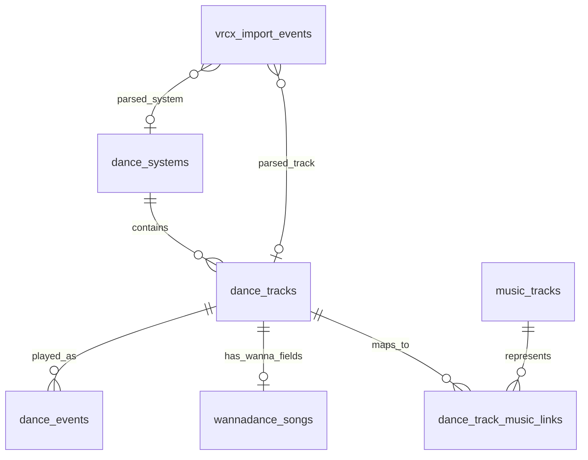

# 跳舞数据模型

日期：2026-05-17

本文描述 `dancing-log` 当前的 SQLite 运行时模型。项目已经不再使用旧的
`songs` 表，也不再使用 `dance_events.song_id`。

英文对应文档：`docs/dance_data_model.md`

## 当前范围

第一轮重构已经直接实现核心模型：

- SQLite 是运行时存储。
- CSV/JSON 只是导入、导出或检查产物。
- 重建时归档旧生成数据，不做原地迁移。
- `data/local_config.json` 和 `data/queued_self/` 会作为本地输入保留。
- WannaDance 是第一个真正实现的舞蹈系统。
- PyPyDance、Dudu、VRDancing 和其他系统暂不支持，等看到真实元数据形状后再设计。
- `music_tracks` 和 `dance_track_music_links` 已实现，当前用保守的标题/歌手匹配。
- 音乐平台匹配和热度快照暂缓。

## 为什么改模型

旧模型对 WannaDance 单系统很方便，但把几类不同概念混在一起：

- 舞蹈系统目录条目
- 真实音乐曲目
- WannaDance 专有缓存字段
- 推荐用的本地偏好元数据
- 播放历史事件

一旦播放事件来自多个舞蹈系统，这种结构就会很别扭。不同系统可能用不同 id
表示同一首歌，同一系统里也可能有同一首歌的不同编舞、remix、镜像版本或人数版本。

当前模型把“某个舞蹈系统里的可播放舞蹈条目”和“真实音乐曲目”拆开。

## 核心概念

### 舞蹈系统

舞蹈系统是可播放条目的命名空间。例子：

- `wannadance`
- `pypydance`
- `dudu`
- `vrdancing`

目前只有 `wannadance` 已实现。

### 舞蹈条目

舞蹈条目表示某个舞蹈系统里的一个可播放版本。

例子：

- WannaDance `3114`: `Boy With Luv (Extreme) / BTS & Halsey`
- WannaDance `5038`: `Good Time / Owl City`
- 未来某个 PyPyDance 条目，有自己的 id 和元数据

稳定身份是 `(system_id, external_id)`。

### 真实音乐曲目

真实音乐曲目表示音乐意义上的歌曲，和舞蹈系统、编舞版本无关。

例子：

- `Good Time / Owl City`
- `Boy With Luv / BTS & Halsey`

它不包含舞者、人数、编舞版本或舞蹈系统 id。

### 跳舞事件

跳舞事件记录某个时间点播放了某个舞蹈条目。

它指向 `dance_events.dance_track_id`，不直接指向 WannaDance id。来源判断
比如 `self`、`other`、`random`、`queued_self` 存在事件上。

## 运行时表

### `dance_systems`

记录支持的舞蹈系统。

| 字段 | 类型 | 含义 |
|---|---|---|
| `id` | INTEGER PRIMARY KEY AUTOINCREMENT | 内部系统 id |
| `key` | TEXT UNIQUE NOT NULL | 稳定机器名，比如 `wannadance` |
| `name` | TEXT NOT NULL | 展示名 |
| `created_at` | TEXT | 创建时间 |

### `dance_tracks`

记录可播放舞蹈条目。

| 字段 | 类型 | 含义 |
|---|---|---|
| `id` | INTEGER PRIMARY KEY AUTOINCREMENT | 内部舞蹈条目 id |
| `system_id` | INTEGER NOT NULL | 指向 `dance_systems.id` |
| `external_id` | TEXT NOT NULL | 舞蹈系统内部 id |
| `title` | TEXT | 系统内标题 |
| `artist` | TEXT | 系统内歌手 |
| `dancer` | TEXT | 舞者、编舞者或版本名 |
| `player_count` | INTEGER | 跳舞人数 |
| `group_name` | TEXT | 系统内分组 |
| `major` | TEXT | 大分类 |
| `favorite` | INTEGER NOT NULL DEFAULT 0 | 本地收藏标记 |
| `want_to_learn` | INTEGER NOT NULL DEFAULT 0 | 本地想学标记 |
| `created_at` | TEXT | 创建时间 |
| `updated_at` | TEXT | 更新时间 |

约束：

```sql
UNIQUE(system_id, external_id)
```

### `wannadance_songs`

记录 WannaDance 专有扩展字段。这些字段不放在 `dance_tracks` 或
`dance_events` 里。

| 字段 | 类型 | 含义 |
|---|---|---|
| `dance_track_id` | INTEGER PRIMARY KEY | 指向 `dance_tracks.id` |
| `wanna_id` | INTEGER NOT NULL UNIQUE | WannaDance song id |
| `cache_category` | INTEGER | 缓存分类 |
| `cache_title` | TEXT | 本地缓存标题 |
| `cache_title_spell` | TEXT | 标题拼写 |
| `cache_player_index` | INTEGER | 播放器索引 |
| `cache_volume` | REAL | 音量 |
| `cache_start_seconds` | REAL | 开始偏移 |
| `cache_end_seconds` | REAL | 结束偏移 |
| `cache_flip` | INTEGER | 翻转标记 |
| `cache_skip_random` | INTEGER | 跳过随机标记 |
| `cache_checksum` | TEXT | 缓存校验 |
| `cache_url` | TEXT | 播放 URL |
| `cache_url_for_quest` | TEXT | Quest 播放 URL |
| `local_video_path` | TEXT | 本地 `video.mp4` 路径 |
| `local_metadata_path` | TEXT | 本地 `metadata.json` 路径 |
| `local_download_path` | TEXT | 本地 `download.txt` 路径 |
| `cache_updated_at` | TEXT | 缓存文件时间 |

### `music_tracks`

记录根据标题/歌手归并出来的真实音乐曲目。

| 字段 | 类型 | 含义 |
|---|---|---|
| `id` | INTEGER PRIMARY KEY AUTOINCREMENT | 内部音乐曲目 id |
| `title` | TEXT NOT NULL | 歌名 |
| `artist` | TEXT | 歌手 |
| `normalized_title` | TEXT NOT NULL | 归一化歌名，用于匹配 |
| `normalized_artist` | TEXT NOT NULL | 归一化歌手，用于匹配 |
| `created_at` | TEXT | 创建时间 |
| `updated_at` | TEXT | 更新时间 |

约束：

```sql
UNIQUE(normalized_title, normalized_artist)
```

### `dance_track_music_links`

记录舞蹈条目到真实音乐曲目的映射。

| 字段 | 类型 | 含义 |
|---|---|---|
| `dance_track_id` | INTEGER NOT NULL | 指向 `dance_tracks.id` |
| `music_track_id` | INTEGER NOT NULL | 指向 `music_tracks.id` |
| `confidence` | REAL NOT NULL DEFAULT 1.0 | 匹配置信度 |
| `match_method` | TEXT NOT NULL | 例如 `title_artist_auto` |
| `created_at` | TEXT | 创建时间 |
| `updated_at` | TEXT | 更新时间 |

约束：

```sql
PRIMARY KEY(dance_track_id, music_track_id)
```

### `dance_events`

记录标准化后的播放时间线。

| 字段 | 类型 | 含义 |
|---|---|---|
| `id` | INTEGER PRIMARY KEY AUTOINCREMENT | 事件 id |
| `played_at` | TEXT NOT NULL | 播放时间 |
| `dance_track_id` | INTEGER | 指向 `dance_tracks.id` |
| `source` | TEXT NOT NULL DEFAULT `unknown` | `queued_self`、`recommend`、`self`、`other`、`random` 或 `unknown` |
| `confidence` | REAL NOT NULL DEFAULT 0.5 | 来源置信度 |
| `event_source` | TEXT NOT NULL | 导入来源，比如 `manual`、`vrcx`、`queued_self_manifest` |
| `event_key` | TEXT NOT NULL UNIQUE | 去重键 |
| `video_url` | TEXT | 原始播放 URL |
| `video_name` | TEXT | 原始视频名 |
| `requester_display_name` | TEXT | 点歌者展示名 |
| `requester_user_id` | TEXT | 点歌者 VRChat user id |
| `location` | TEXT | 世界或实例上下文 |
| `note` | TEXT | 手动备注 |
| `recording_id` | INTEGER | 未来关联录屏 |
| `recording_offset_seconds` | REAL | 未来录屏偏移 |
| `imported_at` | TEXT | 导入时间 |

### `vrcx_import_events`

记录 VRCX 导入溯源和解析结果。

| 字段 | 类型 | 含义 |
|---|---|---|
| `id` | INTEGER PRIMARY KEY AUTOINCREMENT | 导入行 id |
| `vrcx_rowid` | INTEGER NOT NULL | 来源 VRCX rowid |
| `created_at` | TEXT NOT NULL | VRCX 事件时间 |
| `video_url` | TEXT | 原始播放 URL |
| `video_name` | TEXT | 原始视频名 |
| `video_id` | TEXT | VRCX video id |
| `location` | TEXT | 世界或实例上下文 |
| `display_name` | TEXT | 点歌者展示名 |
| `user_id` | TEXT | 点歌者 user id |
| `parsed_system_id` | INTEGER | 解析出的舞蹈系统 |
| `parsed_external_id` | TEXT | 解析出的系统内 id |
| `parsed_dance_track_id` | INTEGER | 匹配到的 `dance_tracks.id` |
| `inferred_source` | TEXT NOT NULL DEFAULT `unknown` | 推断来源 |
| `confidence` | REAL NOT NULL DEFAULT 0.5 | 来源置信度 |
| `event_key` | TEXT NOT NULL UNIQUE | 去重键 |
| `imported_at` | TEXT | 导入时间 |

## 关系图



## 查询路径

从事件查舞蹈系统条目：

```text
dance_events
  -> dance_tracks
  -> dance_systems
```

从 WannaDance 事件查专有缓存字段：

```text
dance_events
  -> dance_tracks
  -> wannadance_songs
```

从舞蹈条目查真实音乐曲目：

```text
dance_tracks
  -> dance_track_music_links
  -> music_tracks
```

从真实音乐曲目查所有舞蹈版本：

```text
music_tracks
  -> dance_track_music_links
  -> dance_tracks
  -> dance_systems
```

## 暂缓的表

音乐平台匹配和热度应当和核心时间线分开：

- `music_provider_matches`：未来记录 `music_tracks` 到 NetEase、Kugou、Last.fm、Spotify
  等平台 id 的映射。
- `music_popularity_snapshots`：未来记录热度、评论数、听众数、播放量等随时间变化的指标。

这些表不应该阻塞当前运行时模型。关键边界是：平台数据属于 `music_tracks`，
不属于某个舞蹈系统条目，也不属于一次播放事件。

## 重建和迁移策略

当前实现不对旧生成数据库做原地迁移。如果检测到旧的 `songs` 表或
`dance_events.song_id` 路径，应用会要求重建。

使用：

```bash
uv run python main.py rebuild-data --archive-existing
```

重建流程会归档：

- `data/dancing_log.sqlite3`
- `data/dancing_log.sqlite3-wal`
- `data/dancing_log.sqlite3-shm`
- `data/songs.csv`
- `data/wanna_songs.csv`
- `data/wanna_songs.json`

并保留：

- `data/local_config.json`
- `data/queued_self/`
