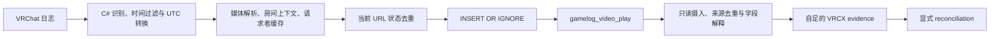

# VRCX 数据库播放证据：分级合同

日期：2026-09-05。正式规则版本：`vrcx-db-conservative-v1`。生产 adapter 尚未实现。

**推荐采用：明确 URL 白名单 + 有效来源时间 + 一行一份来源证据 + 仅重复摄入去重。**
判断输入限于 VRCX 数据库。watcher 只作研究参照，不参与准入、去重、状态判断或计数。
本合同优先避免猜错舞蹈身份、吞掉不同播放、补造请求者和完成事实，同时保留绝大多数
可识别来源行。接受重试行可能重复计入、同 URL 被上游去重后无法恢复等剩余误差。

## 规则分级与生效范围

| 等级 | 内容 | 当前作用 |
| --- | --- | --- |
| A：正式合同 | 下文 A1–A6 的确定规则 | 参与证据发布、来源去重和默认计入 |
| B：只保留信息 | 视频行原始标题、video_id、请求者、完整 URL/location，以及来源版本等审计信息 | 保留或展示来源原值；任何二次解释均不改变发布、合并和计入结果 |
| C：研究候选 | 更多 URL 形式、跨表补全、跨行归并、开始/结束/失败推断、watcher 对照 | 仅记载研究方向；未纳入正式执行规则，也不后台隐式应用 |

等级表示是否纳入合同，不是 confidence 分数。B/C 不形成附加过滤器、修补分支或隐藏
计数抑制。将来升级必须明确规则版本与验证依据；本版本不自动“学习”新规则。

## A 级：当前正式合同

### A1. 一致、完整地读取视频表

以只读连接和一致快照读取 `gamelog_video_play` 的全部八列，按 `id` 排序；当前采用
全量对照，不使用最近 N 天、最后时间、最后行号或 UI 条数上限作为唯一读取范围。
原始层区分 `NULL`、空串和含空白字符串，保留未支持输入及原因。未知表结构先报不兼容，
不向 VRCX 库写入任何修复。源码状态机、相邻行和其他业务表不是读取前置条件。

### A2. 只用白名单播放地址确定舞蹈身份

对 URL 进行结构解析，使用完整 hostname 与明确 path 规则，取唯一的十进制正整数 id。
以下五个主机的四种结构是本版全部支持范围；不采用 `host contains pypy/dudu` 等匹配。

| 系统 | 完整主机 | path 与 id 位置 | 本快照通过行数 |
| --- | --- | --- | ---: |
| WannaDance | `api.udon.dance` | `/Api/Songs/play` 或 `/api/songs/play`；唯一 query `id` | 13,012 |
| WannaDance | `api.wannadance.online` | 同上 | 988 |
| PyPyDance | `api.pypy.dance` | `/video`；唯一 query `id` | 109 |
| PyPyDance | `jd.pypy.moe` | `/api/v1/videos/<id>.mp4` | 92 |
| DuduFit | `api.dudufit.dance` | `/api/v1/videos/<id>` | 256 |

地址允许 HTTP/HTTPS 及其默认端口，主机名忽略大小写，path 只接受上表列出的形式；
不跟随重定向、不请求网络、不猜域名别名。拒绝带 userinfo、非默认端口、字面空白或
控制字符的 URL。标准 query 解码后 `id` 必须恰好出现一次，值满足 `[1-9][0-9]*`；
path 中的 id 使用同一格式。`id=7&id=8`、`id=7abc`、编号 0、前导零及未知形式保留为
未支持输入，不取第一个值或截取数字补救。额外 query 参数保留原值，不产生播放次数依据。

舞蹈键只由这套 URL 规则产生。`video_id`、标题、world 名称和当前 catalog 不提供备用
识别路径，也不作为相互校验的强制条件。缺少 catalog 条目不妨碍保存稳定舞蹈键。

### A3. 时间只解释为来源记录时间

`created_at` 必须是有效日期时间，格式为 `YYYY-MM-DDTHH:MM:SS`、可选的 1–6 位小数秒，
以及必需的 `Z` 或 `±HH:MM` offset。原值和解析后的 UTC 一起保存，时间依据为
`source_log_time`。不加固定延迟、不改成导入时间、不使用本机
当前时区补缺失 offset。无效或缺时区的时间先保留为诊断输入，不发布有效播放证据。

时间不表示实际开始。实际开始、结束、播放时长、成功、失败和完成均保持未知。
两个记录之间的间隔不用于补出任何这些字段。

### A4. 一行一份自足证据，仅消除重复摄入

新来源行满足 A2、A3 时，发布一份包含全部原值、稳定舞蹈键、来源时间和解析版本的
VRCX evidence。名称、请求者、`video_id`、location 等可选字段缺失不阻塞发布。
这里的“一行”是一次来源观察，不承诺一次完整播放。

来源位置采用持久登记的逻辑 VRCX 来源身份、表名、原 `id`；已确认的整库替换使用新的
来源代次。文件路径、导入批次和快照 hash 不充当永久来源身份，不自动猜测不同库的血缘。
完整八列的确定性原值编码形成独立内容指纹。处理只有三种：

| 同一来源位置的输入情况 | 行为 |
| --- | --- |
| 尚无有效或待 reconciliation 的相同输入 | 发布一次 |
| 原值指纹相同，已经保存过该输入 | 复用原 evidence identity，不再发布；不因 membership 已关闭而自动恢复 |
| 原值指纹改变 | 保留冲突输入，不覆盖旧证据，也不自动当作另一次播放 |

来源摄入只处理“是否已经保存”，不判断 evidence 当前是否参与 occurrence。已关闭的
membership 只能由明确的身份操作恢复，重复导入既不创建第二份 evidence，也不自动恢复。
其他来源位置后来出现相同内容，仍按自己的位置产生证据。源库删行不自动删除本地不可变
证据，也不撤销 membership 或用户判断。

**不同来源位置之间，本版没有自动 `merged` 规则。** 同 URL、同舞蹈、同实例、同请求者、
时间相同或相近都不产生自动归并。数据库没有保存足够的播放过程身份，不能因数值吻合
就宣称同一次播放。也不自动折叠 A→B→A、路由切换或所谓短时间重试。

### A5. 请求者保留来源主张，不补身份与请求方式

`display_name` 和 `user_id` 按原行成组保留，缺哪项就缺哪项；不查询相邻视频、玩家
进出表、全局显示名缓存或当前登录账号回填。非空名字不证明手动点播，空名字不证明
random；即使名字文本为 `Random`，也不在缺少明确语义字段时自行认定随机。

adapter 不把 self/other/random/recommend/queued_self 等产品解释固化成来源事实。
已有公共 self/other 规则若使用经用户确认的本人 id 集合，仍只是在解释 VRCX 报告的
身份；本合同不额外认证或修正这个 user id，也不靠库内账号表自动确认本人。

### A6. 默认计入遵守明确的产品取舍

证据发布后及时进入公共 reconciliation；在本版数据库范围内，没有严格既有归属或
用户判断的新行保持独立。已发布、仅由 VRCX 支持、且没有人工覆盖的 occurrence 默认
`accepted`。未支持 URL、无效时间、同位置内容冲突停留在输入层，不以新 occurrence 计入。

`accepted` 表示默认纳入历史统计，completion 仍为未知。为了简单和保留来源覆盖，
本版不对已通过的行再叠加“标题完整”“附近无错误”“间隔够长”等接受门槛。此选择会
保留一部分预览、失败加载或重试记录，不能承诺真实完成次数的高精准率。

## 仅据数据库的覆盖与取舍

`scripts/evaluate_vrcx_contract.py` 在只读冻结快照上运行上述 URL/时间准入；没有读取
watcher 产物、原始日志或 catalog。规则级边界检查和真实行核算结果如下：

| 项目 | 结果 |
| --- | ---: |
| 读取的来源行 | 14,784 |
| 原较宽 URL parser 可识别 | 14,483 |
| 本版 A 级可发布行，假设首次导入且无位置冲突 | 14,457 |
| 占原 parser 可识别行 | 99.82% |
| 占全部视频表行 | 97.79% |
| 保留为未支持输入 | 327 |

先前较宽 URL parser 的审计结果为 14,483 行；相对它少纳入 26 行：IP 地址 9 行、CDN
文件地址 1 行、Dudu 编号 0 共 16 行。
这是主动收窄支持范围，不表示已证明这 26 行是假播放；包括编号 0 的真实语义都留待
单独确认。原先 301 条未支持行也继续保留。以上比例是**来源行准入覆盖**，不是播放召回率。

保留高覆盖的主要办法是不过度要求可选 metadata：若在 A 级结果上再要求标题非空，
会额外丢掉 1,023 行；要求请求者 user id 非空会丢掉 3,063 行；要求 `video_id` 非空会
丢掉 14,167 行。这些缺失本身不能证明没有播放，因此不增加这些门槛。

剩余假阳性主要是失败/预览也被 VRCX 记行，或一次加载的重试留下多行；剩余假阴性
主要是 VRCX 未收录、上游同 URL 去重、暂不支持的地址/编号，以及不可解释的时间或
来源位置冲突。数据库不能独立提供真实播放真值，因此不为 precision/recall 编造百分比。
本版能保证规则确定、可复核；它无法保证上游记录本身完整或无误。

## B/C 级：保留价值与升级条件

| 等级 | 保存的信息或候选能力 | 潜在收益 | 暂不进入正式判断的原因 |
| --- | --- | --- | --- |
| B | 八列原值，完整 URL 的 node/cdn 等参数 | 后续重新解析身份、研究路由关系 | 相同舞蹈或不同路由不能直接证明一次播放 |
| B | 原标题、video_id、请求者对、完整 location | 后续字段解释与人工核对 | 来源表示、缓存和缺失语义不同，不能加成准入门槛 |
| B | 来源登记、schema、快照批次、可获得的版本信息 | 复核来源变化与解析规则 | 最后运行版本不等于每行生成版本，不据此重放状态机 |
| C | 明确 IP/更多历史域名、CDN 文件名、网页 URL、编号 0 | 扩大舞蹈键覆盖；本样本有 26 行直接候选 | 需分别确认标识语义后升级白名单，不做字符串兜底 |
| C | gamelog_location / join_leave 关联 | 补全实例和请求者 | 无视频请求外键，存在缓存/同名/时间归属歧义 |
| C | 相邻视频、错误事件、房间进出与间隔 | 研究重试、失败、开始/结束和同次播放 | 无稳定过程身份，容易以推测修补推测 |
| C | watcher 与原始日志对照、额外世界 parser | 帮助验证来源语义及未来跨来源规则 | 当前 watcher 只作参照，不是本合同的输入或真实播放标签 |
| C | 行号游标、回看窗口等增量读取 | 优化读取性能 | 当前规模全量足够简单，不能以局部回看替代完整性 |

B 中视频行原值已由 A1 保存；其他表只在独立研究快照中按需保留，本版正常导入不要求
抓取它们，更不新建补全缓存或状态推断链。C 项升级应逐项提出有限规则、正反例和影响
范围；只有明确收益且不破坏 A 级不变量时，才以新版本纳入，不依靠累计打分或补丁例外。

## 附录：源码与实验依据，不增加执行规则

以下保留先前源码调查，解释本合同为什么有这些边界。这里描述的 VRCX 内部行为不是
要求 DanceTrail 重新模拟的算法，也不构成 A1–A6 之外的过滤或推断规则。

## 版本与验证范围

本地冻结数据库记录最后版本为 `VRCX 2026.07.18`、数据库版本为 `16`。
本次追踪官方标签 `v2026.07.18`，已通过 GitHub commit API 确认其提交为
`eafcccb20ed5828d99bd1b0f4b53a384a52a1d47`。链路包括：

- `Dotnet/LogWatcher.cs`：日志识别、截断时间、时间转换、房间事件；
- `src/services/gameLog.js`、`src/coordinators/gameLogCoordinator.js`：输入分派和上下文；
- `src/stores/gameLog/mediaParsers.js`、`index.js`：媒体解析及是否尝试写库；
- `src/shared/utils/user.js`、world/location helpers：请求者与世界判断；
- `src/services/database/index.js`、`gameLog.js`：表结构、实际插入、启动补读与删除。

另对照 `v2025.06.30` 的 `src/classes/gameLog.js`、`src/service/database.js`，其提交为
`255baad3b4cdafaad7e43e68c3029cbf2784e2b5`。两个版本都具有同 URL 去重、PyPyDance 的
Random 清空、显示名缓存匹配、相同视频表唯一约束。已有可见差异：旧版同 URL 的更新
对象使用 `created_at`，新版使用 `updatedAt`。本次没有逐一审计中间所有版本。
依据：[旧版媒体解析](https://github.com/vrcx-team/VRCX/blob/255baad3b4cdafaad7e43e68c3029cbf2784e2b5/src/classes/gameLog.js#L605)、
[旧版表结构](https://github.com/vrcx-team/VRCX/blob/255baad3b4cdafaad7e43e68c3029cbf2784e2b5/src/service/database.js#L61)。

**“最后运行版本”不能解释为每一行的生成版本。** 快照包含 2025-07 至 2026-09 的历史，
表中没有每行生成版本、原日志文件名、行号、输入 parser、VRCX 运行 session 或请求 id。
无法确定历史行的 parser 时，应保留未知；不能仅凭视频 URL host 反推它走了哪个日志分支。

`scripts/probe_vrcx_source_contract.cjs` 在校验 SHA-256 后，抽取并运行上述固定版本的实际
JavaScript 函数和 SQL；使用合成输入、受控时钟、内存 SQLite，20 项探针全部通过。
UI、定时器调度、缓存数据和外部 API 使用桩，不运行完整 VRCX、C# watcher 或 IPC。
这证明指定条件下的代码行为，不提供真实播放精准率，也不验证全部异步交错。

本轮分析只读取先前冻结快照；没有重新操作外部 VRCX 数据库和原始 VRChat 日志。
源码缓存、探针结果和含本地统计的文件保存在忽略提交的 `analysis/vrcx-merge-review-20260905/`。

## 一行如何产生



VRCX 同时接受世界发出的 `[VRCX] VideoPlay(...)` 和通用媒体加载语句，后者包括
`Attempting to resolve URL`、`Resolving URL`、`User … added URL …`、特定格式的
`USharpVideo Started video load`。通用分支经过 `decodeURI`，还受固定 RPC 世界列表限制；
明确标为 YouTube 的特殊分支可以绕过此限制。我们的 watcher 能解析的更宽泛前缀，不能
自动算作 VRCX 也会识别的输入。
依据：[原生输入识别](https://github.com/vrcx-team/VRCX/blob/eafcccb20ed5828d99bd1b0f4b53a384a52a1d47/Dotnet/LogWatcher.cs#L700)、
[通用分派](https://github.com/vrcx-team/VRCX/blob/eafcccb20ed5828d99bd1b0f4b53a384a52a1d47/src/coordinators/gameLogCoordinator.js#L306)、
[媒体入口](https://github.com/vrcx-team/VRCX/blob/eafcccb20ed5828d99bd1b0f4b53a384a52a1d47/src/stores/gameLog/mediaParsers.js#L26)。

是否写行取决于状态：

1. 通用入口先比较 `lastVideoUrl`；相同 URL 可以在进入媒体 parser 前被忽略。
2. 世界 parser 对相同 `nowPlaying.url` 只传递位置、时长等更新。
3. `setNowPlaying` 仅在 URL 变化时尝试插入；同 URL 分支不更新原历史行。
4. 换房流程会重置相关状态。当前播放的本地计时结束也会清空 `nowPlaying`，但仅清空
   `nowPlaying` 不会同时清空通用入口的 `lastVideoUrl`。
5. 数据库再以 `(created_at, video_url)` 唯一约束执行 `INSERT OR IGNORE`。

依据：[当前播放与计时](https://github.com/vrcx-team/VRCX/blob/eafcccb20ed5828d99bd1b0f4b53a384a52a1d47/src/stores/gameLog/index.js#L225)、
[房间重置](https://github.com/vrcx-team/VRCX/blob/eafcccb20ed5828d99bd1b0f4b53a384a52a1d47/src/coordinators/locationCoordinator.js#L193)、
[视频写库](https://github.com/vrcx-team/VRCX/blob/eafcccb20ed5828d99bd1b0f4b53a384a52a1d47/src/services/database/gameLog.js#L199)。

所以一行能够证明：**VRCX 收录了一个媒体相关日志观察。** 它可能发生在加载请求、
同步到已有播放的位置，或 URL 切换时。成功开始、用户观看了多久、完成和停止原因均不能
从这一行确定。同一次播放的路由重试可以留下多行；同 URL 的重新请求可能只保留一行。

## 来源字段说明

| 数据库字段 | 已查明的来源 | adapter 应保存和解释的内容 |
| --- | --- | --- |
| `id` / `rowid` | 表内 SQLite 行坐标；`INTEGER PRIMARY KEY`，没有 `AUTOINCREMENT` | 保存原坐标与来源身份；公共 evidence 使用自己的主键，不把行号解释为播放 id |
| `created_at` | 原日志前 19 字符的本地秒级时间转 UTC；不是数据库插入墙钟 | 保存原字符串、解析后的 UTC 和时间语义 `source_log_time`；实际开始时间仍未知 |
| `video_url` | 世界 parser 的 URL，或通用入口 `decodeURI` 后的值；LSMedia/Popcorn 还会填入片名 | 无损保留原值；另用版本化解析器得到舞蹈键；不统一对数据库值再次 URI 解码 |
| `video_name` | 各世界特定的标题解析，或可选 YouTube API 查询 | 保留源标题；展示清洗及 catalog 标题单独处理，缺失不拒绝有效舞蹈键 |
| `video_id` | 可能是世界编号、空串，或 `YouTube` / `LSMedia` / `PopcornPalace` 等标识 | 保留原值，不能跨世界直接充当舞蹈 id，也不能要求它非空 |
| `location` | 解析时传入的房间上下文；原生 Joining 路径会移除 `/` | 保留完整字符串；另派生 world/instance。未知或缺上下文时不以当前房间回填 |
| `display_name` | 媒体输入中的名字；部分 parser 会把 `Random` 清空 | 保存原值；空值只支持请求者未知，不能自动推出 random/manual/self |
| `user_id` | 多条媒体路径按显示名查询缓存，取首个命中；不要求它在当前房间 | 保留为 VRCX 报告的身份，并保留与名称同组的来源；不能当作独立身份认证 |

原始层区分 SQL `NULL`、空串和含空白的字符串；归一化值放在派生字段，不覆盖 raw。
固定顺序的全部原列参与内容指纹，避免漏掉标题、位置或 `video_id` 的变化。

时间依据：[本地秒转 UTC](https://github.com/vrcx-team/VRCX/blob/eafcccb20ed5828d99bd1b0f4b53a384a52a1d47/Dotnet/LogWatcher.cs#L319)。
转换依赖 VRCX 解析时的操作系统时区规则，数据库没有保留该时区。已带 `Z` 的时间按 UTC
读取，不再套用 DanceTrail 当前机器的时区。历史值若缺少时区，需使用明确来源配置或
保持时间未决；单独从 `.000Z` 也不能断言所有旧版本的输入精度。

身份依据：[缓存按显示名取首个命中](https://github.com/vrcx-team/VRCX/blob/eafcccb20ed5828d99bd1b0f4b53a384a52a1d47/src/shared/utils/user.js#L298)。
快照中 14,483 条可识别舞蹈行有 2,316 条两项请求者字段都为空。它们不能全部标成已证实
随机，也不能全部标成误判。两种语义生成同样行的反例已通过源码探针验证。

**数据库没有保存** position、duration、isPaused、looping、OnVideoStart、OnVideoEnd、
加载错误与本行的外键关系。源码中出现这些字段，不能据此往 evidence 里补造它们。
LSMedia/Popcorn 的特殊存值依据见
[对应 parser](https://github.com/vrcx-team/VRCX/blob/eafcccb20ed5828d99bd1b0f4b53a384a52a1d47/src/stores/gameLog/mediaParsers.js#L311)。

## 读取实现的依据

只读连接使用 SQLite `mode=ro`、`query_only=ON`；一致读事务或 backup API 可以提供
一致输入。运行中的源库不能用 `immutable=1` 跳过锁和变化检测。源库不执行 checkpoint、
迁移、建索引或改变持久状态的 pragma。本版不实现增量窗口；源码探针确认仅用时间游标
可能漏掉晚插入的旧时间行，删去最大 id 后还可能复用行号。

表约束与删行路径依据：
[视频表建表](https://github.com/vrcx-team/VRCX/blob/eafcccb20ed5828d99bd1b0f4b53a384a52a1d47/src/services/database/index.js#L181)、
[删除视频历史](https://github.com/vrcx-team/VRCX/blob/eafcccb20ed5828d99bd1b0f4b53a384a52a1d47/src/services/database/gameLog.js#L1658)。
只读与快照依据：[SQLite URI 参数](https://www.sqlite.org/uri.html)、
[在线 backup API](https://www.sqlite.org/backup.html)；行号复用依据：
[SQLite ROWID 与 AUTOINCREMENT](https://www.sqlite.org/autoinc.html)。

## 其他表与源码能补到哪里

`gamelog_location` 可提供实例历史，`gamelog_join_leave` 可提供同一实例、相近时段的名字与
user id 对应；保存关联依据后可支持字段解释。它们没有视频请求外键，最近一条同名玩家
或同世界记录不能直接成为播放身份。视频表也不按登录账户分表，不能把库内全部行自动
归到当前 VRCX 账号；self 继续使用用户确认过的身份集合。

`gamelog_event` 中的视频错误可提供诊断，但上游会按错误文本在上下文中去重，表只有
时间和文本，通常没有视频 URL 或实例外键。不能把最近错误直接分配给最近视频，也不能
因为没有错误就判断播放成功。本样本 resource_load / external 均为空，不能增加已测覆盖。
依据：[原生错误收录](https://github.com/vrcx-team/VRCX/blob/eafcccb20ed5828d99bd1b0f4b53a384a52a1d47/Dotnet/LogWatcher.cs#L625)。

VRCX 自身也不是完整的原始日志归档：禁用 game log、原生格式匹配失败、RPC 世界过滤、
同 URL 状态去重、唯一键冲突、时间截止和未运行都可能造成缺行。启动补读的 cutoff 来自
多张表尾记录，且有 24 小时条件；C# 跳过小于等于 cutoff 的日志。不要把这套“继续当前
会话”的读取方式复制为 DanceTrail 历史导入规则，更不能把 VRCX 缺行当作未播放证明。
依据：[启动 cutoff](https://github.com/vrcx-team/VRCX/blob/eafcccb20ed5828d99bd1b0f4b53a384a52a1d47/src/services/database/gameLog.js#L1138)、
[原生日志过滤](https://github.com/vrcx-team/VRCX/blob/eafcccb20ed5828d99bd1b0f4b53a384a52a1d47/Dotnet/LogWatcher.cs#L201)。

## 对现有方案的修正

v2 文档中不可变证据、来源位置与指纹分开、空 requester 不自动 random、严格证明后归并的
方向与源码吻合。原审阅所说“先修 watcher 边界”适用于自动归并放行；**它不应成为 VRCX
adapter 发布独立来源证据的前置条件。**

当前旧 importer 不能直接视为上述合同的实现：

| 当前实现位置 | 已存在的行为 | v2 需要的处理 |
| --- | --- | --- |
| `vrcx_importer.py:217` | `infer_source` 的默认空请求者解释为 random，给固定 confidence | raw 只保存来源事实；未知与规则解释分开，固定分数不当作实测概率 |
| `vrcx_importer.py:246` | `_event_key` 混合 rowid、部分内容；未包括 title、video_id、location | 稳定来源位置与全部原列 fingerprint 分开，内容变化可见且待裁决 |
| `vrcx_importer.py:320` | 不支持的 URL 在 staging 之前跳过 | 原始输入保留，并标记未支持原因，便于未来规则重解析 |
| `vrcx_importer.py:433` | 直接以 created_at 写 played_at | 保留“来源日志时间”的字段依据，actual start / completion 未知 |
| `vrcx_importer.py:532` | provenance 以项目 staging/旧表坐标为身份中心 | v2 使用可识别外部来源的稳定位置，不把导入作业行号当外部行身份 |

本轮没有迁移旧 importer。上述差距属于 v2 的落地要求，不把旧实现的兼容行为判成
本次文档改动引入的回归。正式范围以本文 A1–A6 为准。

## 验证结果与精度边界

20 项源码探针覆盖同 URL 请求、换路由、重置、计时结束、历史输入、正 position、通用
加载、晚到 metadata、RPC gating、URI 解码、请求者缺失、缓存歧义、非 URL 存值及 SQL
唯一约束/行号复用/时间游标。主要反例结果：

| 合成条件 | 已运行的结果 | 读取规则的意义 |
| --- | --- | --- |
| Alice 请求 A，稍后 Bob 请求同 URL A | 只保留 Alice 的一行 | 同 URL 不能保证捕获每次重播或最新请求者 |
| 同一舞蹈由节点 A 切换到节点 B | 两行 | 行数不能直接当真实播放次数 |
| 通用加载 A 后出现 A 的详细标记 | 一行，标题和请求者仍为空 | 等待以后重读不会自然补出已丢字段 |
| `(Random)` 与 `()`，其他输入完全相同 | 八列完全一致 | 单靠这一行无法恢复随机语义 |
| 两个同名缓存用户，先加入者不在房间 | 命中先加入者 | 保存 user id 不代表已验证同房间身份 |
| 同秒、同 URL，但 location/requester 改变 | 两次插入尝试，数据库只有首行 | SQL 唯一键不能充当无碰撞 occurrence id |
| 同组标记实时处理与晚一小时送入 JS | 分别一行、两行 | 去重受墙钟状态影响；此项未模拟原生 cutoff |
| 同 URL 的 position=0 更新 | 新版计时 startTime 可为 NaN | 更不能从 UI timer 推导持久完成事实 |

数据库摄入的无损性、字段解析正确性、归并精准率、真实播放计入率是四个不同指标。
本轮能验证源语义与边界反例；旧归并实验的 watcher 候选覆盖率不用于评价本合同。
源行级别可以做到完整、幂等地读取；VRCX 已经去重、忽略或
未保存的播放信息，单靠数据库无法恢复。对完成事实的假阳性/假阴性仍需要原日志或独立
标注评估，不能从 source table 自证 100%。

## 复现

只读评估正式合同的 URL/时间准入（不运行 watcher）：

```powershell
& .venv\Scripts\python.exe scripts/evaluate_vrcx_contract.py `
  analysis/vrcx-merge-review-20260905/VRCX.snapshot.sqlite3 `
  --output analysis/vrcx-merge-review-20260905/conservative_contract_evaluation.json
```

该脚本是离线审计，不是生产 adapter；输入层持久化、来源冲突裁决和 membership 幂等
仍需在 v2 实现时按主设计验收。准入验证也不能替代这些持久化验收。

使用 Node 22.13+（本次为 24.19.0），在仓库根目录执行。已缓存源码时不需要网络：

```powershell
node scripts/probe_vrcx_source_contract.cjs `
  analysis/vrcx-merge-review-20260905/upstream `
  --report analysis/vrcx-merge-review-20260905/source_contract_probes.json
```

在其他 checkout 可用新缓存目录并加 `--fetch` 下载固定提交，文件 hash 不符会停止：

```powershell
node scripts/probe_vrcx_source_contract.cjs analysis/vrcx-source-probe --fetch `
  --report analysis/vrcx-source-probe/results.json
```

`source_contract_probes.json` 保存每项结果及十份执行相关源码的 hash；
`source_contract_snapshot_metrics.json` 保存本地冻结数据库指纹和本轮窄查询统计。
所有 probe SQL 仅在 `:memory:` 数据库执行。
